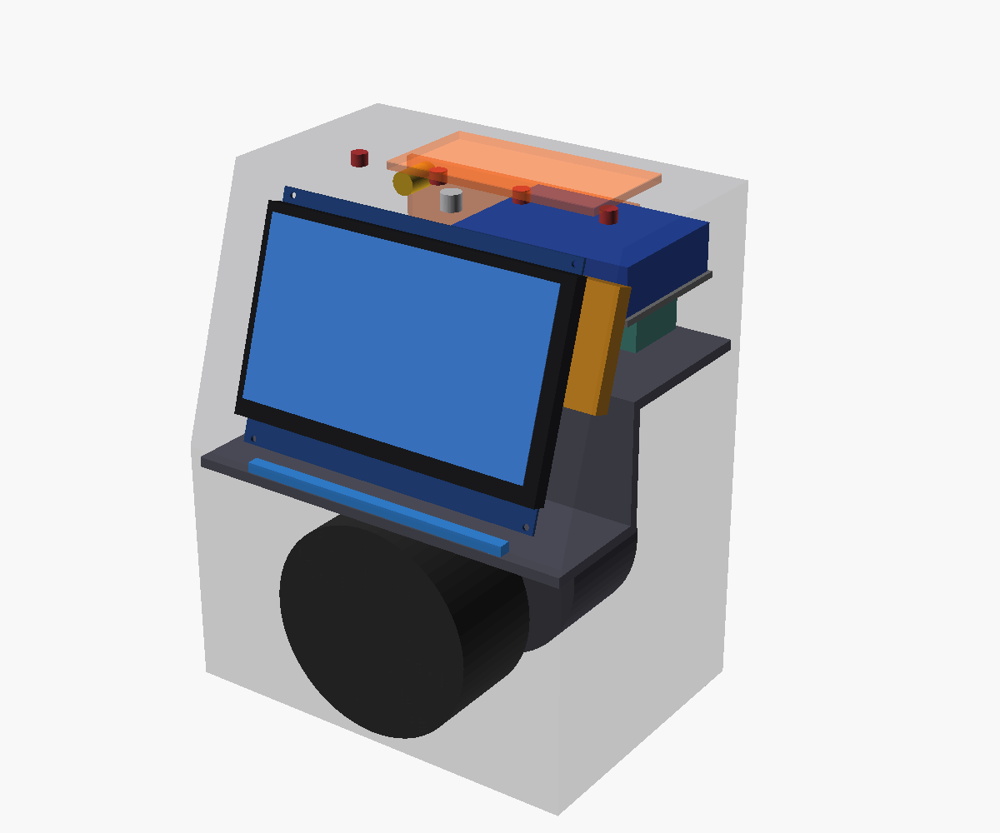

# Prisma
Asistente inteligente de sobremesa con Raspberry Pi 5, pantalla táctil de 7", avatar 3D y audio integrado.

**Estado actual: volumétrico v0.3.** Las cotas provisionales deben verificarse antes de fabricar piezas definitivas.



## Hardware
- Raspberry Pi 5 8 GB — confirmado
- Waveshare 7inch HDMI LCD (C), 1024×600 — recibido
- Dayton DMA105-4 — propuesto
- Dayton DMA105-PR — propuesto
- Dayton KABD-250 — propuesto
- DAC I²S→analógico — pendiente
- Matriz de 2–4 micrófonos — pendiente
- WS2812B, 8–12 LEDs — propuesto
- Cámara — opcional
- Fuente externa 24 V — pendiente
- Buck 24→5 V — pendiente

## Arquitectura
```text
Pantalla → Raspberry Pi 5 → DAC → KABD-250 → DMA105-4
                 │
                 ├── micrófonos
                 ├── LEDs
                 └── cámara opcional
```

## Distribución (v0.3)
```text
              techo: micrófonos · cámara · salida de aire
           ┌───────────────────────────┐
          ╱   bahía: Pi 5 · KABD · DAC │ ← rejilla + DC 24 V
 pantalla╱      ┌──────────────────────┤
   18°  ╱ canal │ cámara (parte alta)  │
       ╱ cables │                      │
 LEDs ├─────────┘                      │
      │                                │
 DMA105-4 ◄  cámara acústica ≈3,3 L  ►  DMA105-PR
      └────────────────────────────────┘
   frente                            trasera
```

- La electrónica queda separada de la cámara acústica, que es estanca.
- La fuente AC/DC es externa: dentro solo entra 24 V.

## CAD
`enclosure/openscad/prisma_volumetrica_v0_3.scad` es una maqueta de distribución, no la carcasa final.

`tools/comprobar_volumetrico.py` mide el volumen neto de la cámara y comprueba interferencias entre componentes.

Consulta `docs/DECISIONS.md`, `docs/08_distribucion.md` y `docs/BOM.md`.
