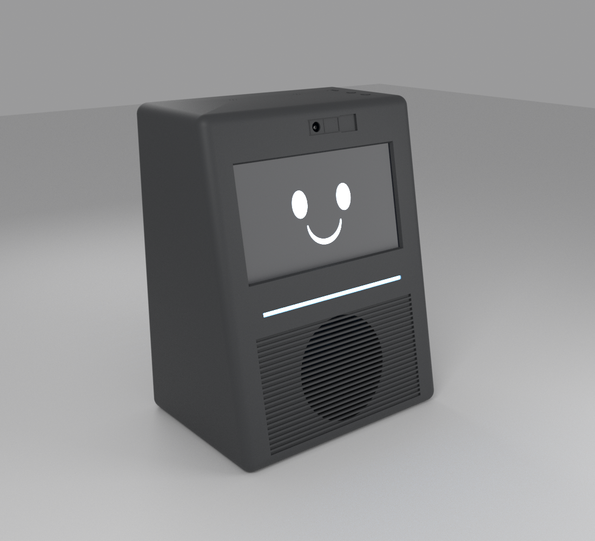

# Prisma
Asistente inteligente de sobremesa con Raspberry Pi 5, pantalla táctil de 7", avatar 3D y audio integrado.

**Estado actual: v0.5.1.** Capucha y cubeta imprimibles; faltan la bandeja y la caja superior de la cámara acústica. Las cotas del altavoz y del radiador se confirmarán con las piezas reales.



## Hardware
- Raspberry Pi 5 8 GB — confirmado
- Waveshare 7inch HDMI LCD (C), 1024×600 — recibido
- Dayton DMA105-4 — pedido
- Dayton DMA105-PR — pedido
- Dayton KABD-250 — pedido
- DAC GY-PCM5102 (PCM5102A, I²S) — propuesto
- ReSpeaker Lite USB (2 micrófonos con AEC) — propuesto
- WS2812B: barra de 8–12 LEDs y dos franjas de tira de 5 mm en los cantos (D033) — propuesto
- Cámara OV5647 5 MP, sobre la pantalla — disponible
- Fuente Mean Well GST60A24-P1J (24 V, 60 W) — propuesta
- Conversor Pololu D36V50F5 (24→5 V, 5,5 A) — propuesto

## Arquitectura
```text
Pantalla → Raspberry Pi 5 → DAC → KABD-250 → DMA105-4
                 │
                 ├── micrófonos
                 ├── LEDs
                 └── cámara
```

## Diseño (v0.5)
Frontal inclinado de arriba abajo, aristas redondeadas y negro mate, como el boceto original:
- **Arriba:** cámara con tapa deslizante y micrófonos en el techo.
- **Centro:** pantalla de 7" en horizontal.
- **Debajo:** franja LED y banda de lamas con el altavoz detrás.
- **Cantos del frontal:** dos franjas transparentes iluminadas por LEDs; el color indica el estado (escucha, pensando, silencio…).
- **Techo:** volumen y silencio de micrófonos.
- **Trasera:** ventilación, alimentación, botón de encendido y radiador pasivo.

Medidas: **205 × 262 × 150 mm**. Cámara acústica de ≈3,1 L netos. Dentro de la carcasa solo entra 24 V; la fuente de red es externa.

## CAD
`enclosure/openscad/prisma_volumetrica_v0_3.scad` es una maqueta de distribución, no la carcasa final.

`tools/comprobar_volumetrico.py` mide el volumen neto de la cámara y comprueba interferencias entre componentes.

Piezas imprimibles: la capucha (`enclosure/openscad/capucha.scad`, ver `docs/14_capucha.md`) y la cubeta acústica (`enclosure/openscad/cubeta.scad`, ver `docs/15_cubeta.md`).

`tools/simulacion_audio.py` simula la respuesta en graves del altavoz y el radiador en la cámara (ver `docs/05_audio.md`).

Consulta `docs/DECISIONS.md`, `docs/08_distribucion.md` y `docs/BOM.md`.
