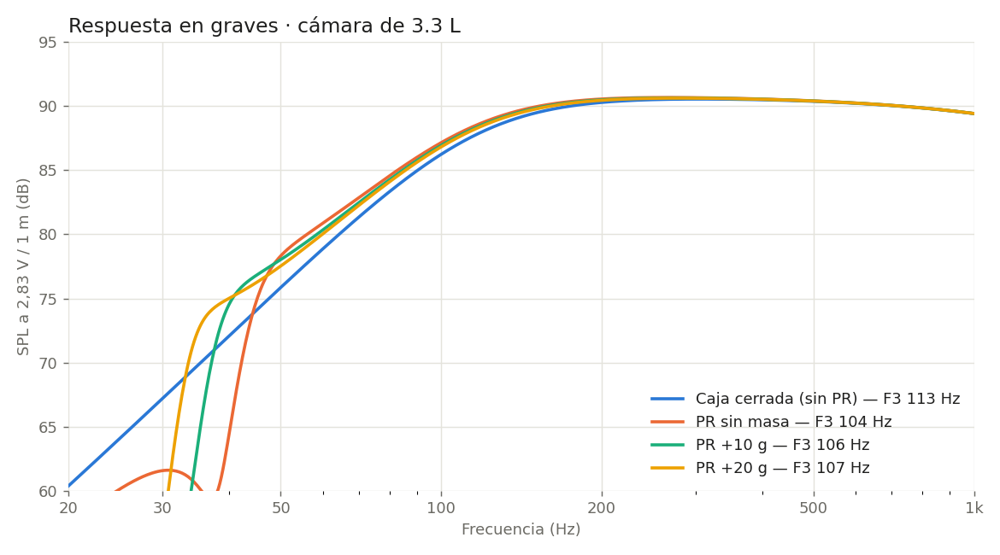
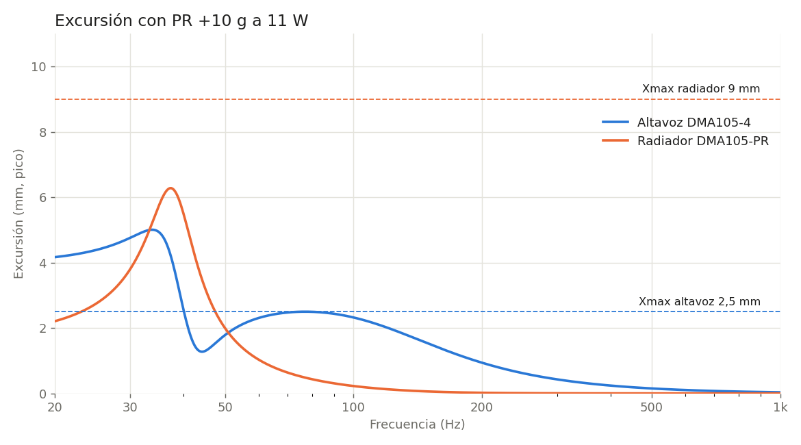

# 05 — Audio
## DMA105-4
4", 4 Ω, 35 W RMS. Transductor principal propuesto. Montado en el frontal inferior vertical (bafle), centrado a z ≈ 57 mm.

## DMA105-PR
4", radiador pasivo propuesto. Montado en la trasera inferior, coaxial con el DMA105-4 (D018). La trasera inferior queda libre: sin puertos, rejillas ni ventilador delante del radiador.

## Cámara acústica (D008, D016)
Forma en L:
- bloque inferior: ancho y fondo completos, de z = 3 a z = 111 mm;
- bloque superior-trasero: desde y = 64 mm hasta la trasera, de z = 111 a z = 170 mm, detrás de la pantalla.

Volumen medido sobre el modelo v0.3 (`tools/comprobar_volumetrico.py`):

| Concepto | Litros |
|---|---:|
| Aire interior descontando DMA105-4 y DMA105-PR | 3,40 |
| Reserva para refuerzos, espuma y cableado | −0,10 |
| **Volumen neto estimado** | **≈ 3,30** |

Dentro del objetivo de 3–4 L. El desplazamiento de los transductores se modela como troncos de cono conservadores; conviene sustituirlo por las cotas reales de Dayton cuando se confirmen.

Solo con un bloque inferior (como en v0.2) la cámara se quedaba en ≈ 2,5 L netos. El bloque superior-trasero es lo que permite llegar al objetivo sin cambiar la envolvente.

## Simulación de graves
`tools/simulacion_audio.py` resuelve el modelo Thiele-Small del altavoz, el radiador y la caja con pérdidas (QL = 7). Radiación en semiespacio (sobre una mesa), a 1 m. Parámetros de las hojas de datos de Dayton:

| | DMA105-4 | DMA105-PR |
|---|---|---|
| Fs | 72,7 Hz | 37,9 Hz |
| Qts / Qms | 0,51 / 2,6 | — / 7,8 |
| Vas | 4,25 L | 2,5 L |
| Mms | 4,5 g | 29,3 g (sin masa añadida) |
| Sd | 54,1 cm² | 54,1 cm² |
| Xmax | 2,5 mm | 9 mm |

Resultados con 3,3 L netos:

| Caso | Sintonía | F3 | Potencia hasta Xmax (≥ 40 Hz) | SPL máx. a 100 Hz |
|---|---:|---:|---:|---:|
| Caja cerrada (sin PR) | — | 113 Hz | 8,0 W | 92 dB |
| PR sin masa | 50 Hz | 104 Hz | 3,3 W | 89 dB |
| **PR + 10 g** | **43 Hz** | **106 Hz** | **10,6 W** | **94 dB** |
| PR + 20 g | 39 Hz | 107 Hz | 10,0 W | 94 dB |

### Conclusiones
- **La pareja DMA105-4 + DMA105-PR funciona en 3,3 L.** El radiador no baja mucho la F3, porque un altavoz de 4" con Qts 0,51 en una caja pequeña da una F3 cercana a 105 Hz en cualquier caso. Lo que sí aporta es un colchón de graves entre 40 y 80 Hz (unos 3–5 dB más que en caja cerrada) y más potencia antes de llegar al Xmax del altavoz.
- **Masa añadida recomendada: unos 10 g** en el vástago roscado del radiador, para sintonizar a unos 43 Hz. Sin masa, la sintonía queda en 50 Hz y el altavoz se descarga justo por debajo, lo que limita la potencia útil a unos 3 W. Con 20 g apenas cambia nada respecto a 10 g.
- **Filtro paso alto obligatorio a unos 40 Hz** (Butterworth de 2.º orden o más). Por debajo de la sintonía el altavoz queda sin carga y supera su Xmax con muy poca potencia. El KABD-250 lleva DSP, así que el filtro puede ir ahí.
- **Límite práctico: unos 10 W de graves por altavoz**, que dan unos 94 dB a 100 Hz y unos 100 dB en medios a 1 m. Es de sobra para una habitación.
- **Margen con DSP:** una subida suave de graves (+4 a +6 dB a 60–80 Hz) extendería la respuesta hacia 70 Hz, a cambio de bajar el volumen máximo. Conviene ajustarla de oído con el aparato montado.
- Las paredes de la cámara, la espuma y las fugas reales cambiarán algo estos números. Hay que confirmarlo midiendo con un micrófono y REW cuando esté montado.

## Pendiente
- Refuerzos internos y posición de la espuma.
- Paso estanco de cables del altavoz (pasamuros sellado en la tapa de la cámara).

La cámara acústica debe quedar aislada del compartimento electrónico.
