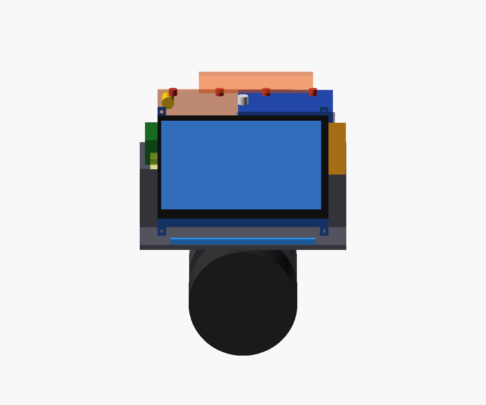

# 06 — Pantalla
Modelo: Waveshare 7inch HDMI LCD (C) Rev4.1, 1024×600, IPS, táctil capacitivo (USB).

**Orientación: horizontal (apaisada)**, para ver vídeo (YouTube, etc.) a pantalla completa. Es la orientación nativa del panel, así que no hace falta rotar nada en el sistema.

1024×600 es un formato ≈ 17:10. Un vídeo 16:9 ocupa todo el ancho y deja dos franjas negras finas, de unos 12 píxeles, arriba y abajo.

## Medidas
Las cotas del PCB, los taladros y los conectores salen del plano oficial de Waveshare. Las del cristal y el área visible, de fotos de la unidad real (±1 mm).

| Cota | Valor | Fuente |
|---|---:|---|
| Ancho total | 164,90 mm | plano |
| Alto total con pestañas | 124,27 mm | plano |
| Alto del PCB entre pestañas | 106,96 mm | plano |
| Hueco entre pestañas (arriba) | 148,90 mm | plano |
| Taladros de fijación | 4 × 156,90 × 114,96 mm entre centros, a 4,0 mm de los laterales | plano |
| Alto del cristal | ≈ 99,8 mm | foto |
| Área visible | 154,21 × 85,92 mm | hoja de datos |
| Margen cristal → área visible | izq. ≈ 3,6 · der. ≈ 7,1 · sup. ≈ 4,9 · inf. ≈ 9,0 mm | foto |
| Cristal → cara trasera del PCB | ≈ 9,5 mm | foto |
| Conectores detrás del PCB | ≈ 7 mm (HDMI) | foto |

Falta medir con calibre el diámetro de los taladros (se asume M3 → 3,2 mm) y el grosor.

## Conectores
Mirando la pantalla de frente, con el flex del LCD abajo:
- todos en el **canto derecho**, en la mitad superior;
- de arriba abajo, medido desde el borde superior de las pestañas: HDMI (18–34 mm), micro-USB del táctil (41–49 mm) e interruptor de retroiluminación (54–62 mm). El HDMI sobresale unos 2 mm del canto;
- las clavijas entran de lado (en horizontal), no por detrás.

Por eso hacen falta **clavijas acodadas** (D021):
- HDMI: cable plano HDMI-A → micro-HDMI con cabezales a 90°, o un adaptador HDMI a 90° + cable;
- táctil: cable micro-USB acodado → USB-A.

El modelo reserva 15 mm libres a la derecha del conector. Con la pantalla centrada, ese hueco llega justo a la pared interior. Cuando elijamos los cables concretos hay que confirmar que su clavija acodada cabe en 15 mm; si no, habría que desplazar la pantalla un par de milímetros a la izquierda o ensanchar la carcasa. Por esto mismo los laterales ya no se estrechan.

El interruptor de retroiluminación queda accesible solo con la carcasa abierta. Déjalo en ON.
