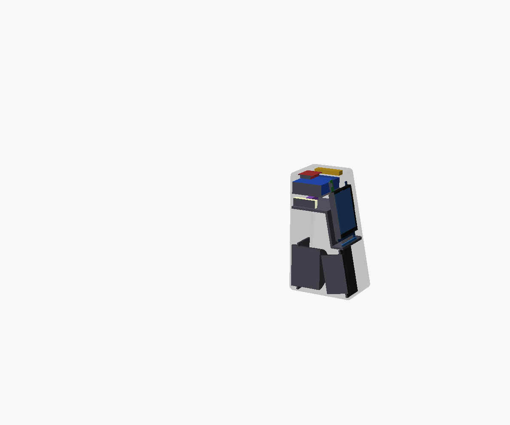
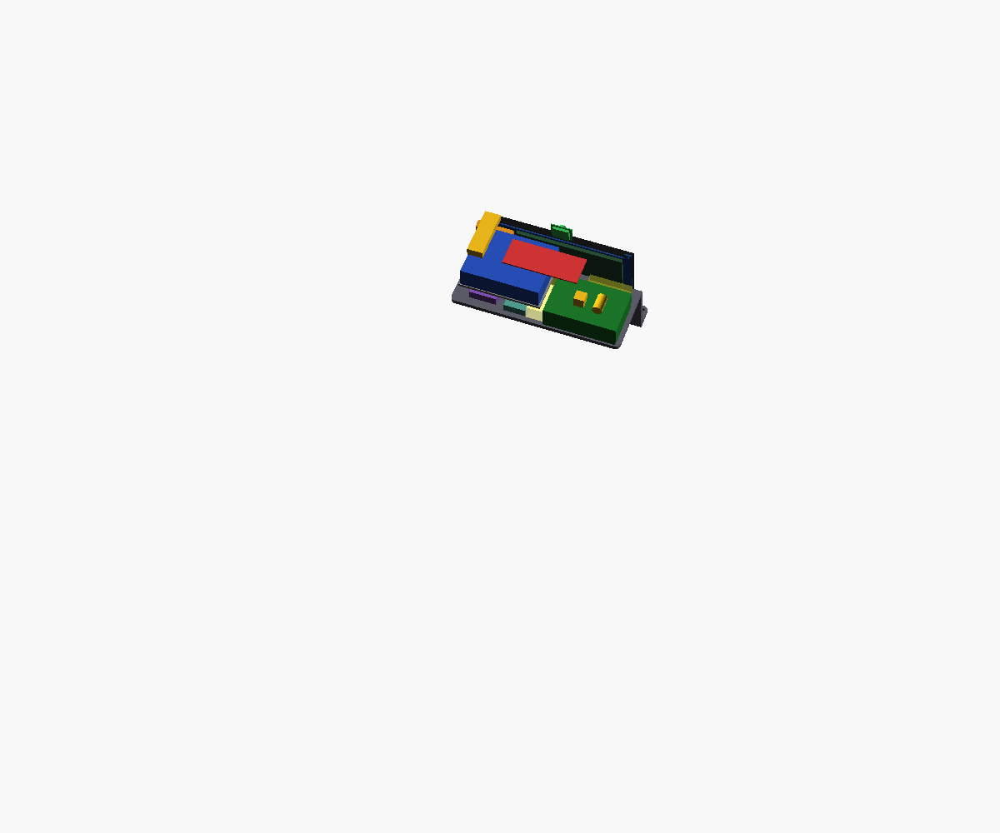

# 08 — Distribución (v0.5)

> v0.5 cambia el perfil (D031): las tablas de abajo describen las zonas, que se mantienen. En el frontal, de abajo arriba van la banda de lamas con el altavoz, la franja LED, la pantalla y la cámara. La parte alta de la cámara acústica queda detrás de un tabique paralelo al frontal, y la electrónica empieza a z = 187 mm.
Envolvente de trabajo: **205 × 262 × 150 mm** (ancho × alto × fondo), con el frontal inclinado 11° de arriba abajo y aristas redondeadas (D031). La altura sale de apilar en el frontal el altavoz, la bandeja de la cámara acústica, la pantalla y la cámara.

## Perfil (D015)
- Frontal inferior vertical hasta z = 122 mm: bafle del DMA105-4 y barra LED.
- Frontal superior inclinado 18° hacia atrás: pantalla. Retranqueo arriba ≈ 41,6 mm, así que el techo mide ≈ 103 mm de fondo.
- Laterales rectos. Con el estrechamiento de 8 mm por lado no cabían las clavijas del canto derecho de la pantalla.

## Zonas
| Zona | Contenido |
|---|---|
| Frontal inferior | DMA105-4, rejilla frontal |
| Franja entre altavoz y pantalla | Barra LED WS2812B (z ≈ 116–122 mm) |
| Franja sobre la pantalla | Cámara Raspberry Pi Camera Module 3, centrada y con la misma inclinación que la pantalla (D025) |
| Frontal superior inclinado | Waveshare 7" en horizontal. Conectores en el canto derecho, mitad superior, con 15 mm libres para clavijas acodadas |
| Detrás de la pantalla | Los conectores quedan a la altura de la bahía: los cables no pasan por la zona de la cámara |
| Interior inferior + superior-trasero | Cámara acústica en L (D016) |
| Trasera inferior | DMA105-PR (D018) |
| Bahía superior (z ≥ 175 mm) | Suelo: Pi 5 con Active Cooler (izquierda), buck y DAC (derecha). Balda encima: KABD-250. Huecos de 20 mm delante de los puertos de la Pi |
| Trasera superior y laterales (altura de la bahía) | Rejillas de ventilación + entrada DC 24 V en la trasera (D017, D019) |
| Techo | ReSpeaker Lite (86 × 35 mm) justo bajo el techo, zona trasera, con 2 agujeros para los micrófonos. Cámara opcional: posición pendiente |

## Criterios
- Todo el calor queda en la bahía superior, ventilada por rejillas en la trasera y en los laterales. Nada de ventiladores junto a la cámara.
- La Pi va en orientación normal. Sus USB miran a la derecha, hacia el hueco libre (ahí va el cable táctil). Los micro-HDMI y el USB-C miran hacia la pantalla.
- El cable HDMI va del canto derecho de la pantalla, delante del KABD-250, hasta el micro-HDMI de la Pi.
- Micrófonos lo más lejos posible del altavoz y desacoplados de la carcasa.
