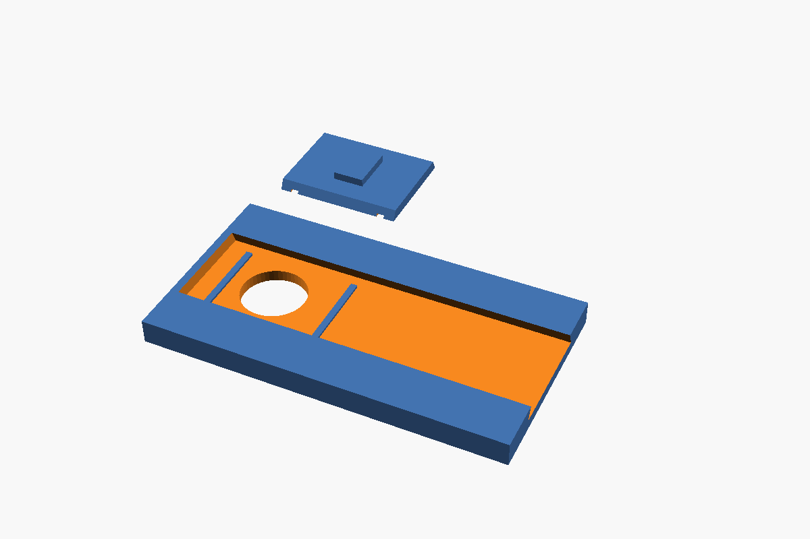

# 10 — Electrónica

## Esquema
```text
Fuente 24 V externa (GST60A24, 60 W)
   │  conector DC de panel (trasera)
   ├──────────────► KABD-250 (amplificador + DSP) ──► DMA105-4
   │                     ▲ entrada AUX analógica
   └─► Pololu D36V50F5 (24 → 5 V, 5,5 A)
          ├─► Raspberry Pi 5 (USB-C)
          │      ├─ I²S ──► GY-PCM5102 (DAC) ──► jack 3,5 mm ──► AUX del KABD-250
          │      ├─ HDMI + USB ──► pantalla Waveshare 7"
          │      ├─ USB ──► ReSpeaker Lite (micrófonos)
          │      ├─ CSI ──► Camera Module 3 (sobre la pantalla)
          │      └─ SPI (GPIO10) ──► 74AHCT125 ──► barra WS2812B
          └─► alimentación de la barra WS2812B
```

## Selección
| Función | Modelo | Por qué | Medidas |
|---|---|---|---|
| DAC | **GY-PCM5102** (PCM5102A) | El KABD-250 solo tiene entrada analógica y Bluetooth, sin I²S. Barato, bien soportado en la Pi 5 (`dtoverlay=hifiberry-dac`), 112 dB SNR, salida jack de 2,1 V rms | 32 × 14 mm |
| Micrófonos | **ReSpeaker Lite USB** (XMOS XU316, 2 micrófonos) | Cancelación de eco, supresión de ruido y ganancia automática por hardware, por USB. El XVF3800 (4 micrófonos) es mejor, pero su placa de 99 mm no cabe bajo el techo con la pantalla inclinada delante | 86 × 35 mm |
| Conversor 24 → 5 V | **Pololu D36V50F5** | 5 V, 5,5 A, entrada de 5,5 a 50 V, 80–95 % de rendimiento, muy compacto | 25,4 × 25,4 × 9,5 mm |
| Fuente | **Mean Well GST60A24-P1J** | 24 V, 2,5 A, 60 W, de sobremesa, clavija 5,5 × 2,1 mm. Da un 60 % de margen sobre el pico calculado | externa |
| Cámara | **OV5647 5 MP** (compatible con la cámara oficial v1.3; ya la tienes) | Foco fijo, 1080p. Suficiente para detectar caras y videollamadas. La Camera Module 3 (autofoco, 12 MP) tiene la misma placa y encaja en el mismo soporte | 25 × 24 mm, unos 9 mm de fondo |
| LEDs | Barra WS2812B (8–12) + **SN74AHCT125** | La Pi da 3,3 V y los WS2812B esperan 5 V en datos: el 74AHCT125 adapta el nivel | — |

## Presupuesto de consumo (estimación)
**Rama de 5 V**

| Consumidor | Pico estimado |
|---|---:|
| Raspberry Pi 5 + Active Cooler | 15 W |
| Pantalla Waveshare 7" | 3 W |
| ReSpeaker Lite | 0,5 W |
| DAC | < 0,1 W |
| 12 × WS2812B, brillo limitado al 40 % | 1,5 W (3,6 W al 100 %) |
| **Total** | **≈ 20 W → 4 A a 5 V** (conversor de 5,5 A: margen de 1,5 A) |

**Rama de 24 V**

| Consumidor | Pico estimado |
|---|---:|
| Conversor (20 W / 0,9) | 22 W |
| KABD-250, un canal a ≈10 W (límite del Xmax, ver `05_audio.md`) | 13 W |
| **Total** | **≈ 35 W** (fuente de 60 W) |

El KABD-250 recomienda 4 A porque está pensado para 2 × 50 W. Aquí solo se usa un canal y el altavoz no admite más de unos 10 W en graves, así que 2,5 A sobran.

## Conexiones
### Alimentación de la Pi 5
- Del Pololu a la Pi con un cable USB-C corto (solo alimentación) y cable de 0,5 mm² o más grueso.
- La Pi 5 solo reconoce 5 A si la fuente lo anuncia por USB-PD, y el Pololu no lo hace. Para que los USB den su corriente completa (la pantalla y los micrófonos cuelgan de ellos):
  - EEPROM (`sudo rpi-eeprom-config --edit`): `PSU_MAX_CURRENT=5000`
  - `/boot/firmware/config.txt`: `usb_max_current_enable=1`

### DAC GY-PCM5102 → Pi 5
| DAC | Pi 5 (pin) |
|---|---|
| VIN | 3,3 V (1) |
| GND | GND (6) |
| BCK | GPIO18 (12) |
| LRCK | GPIO19 (35) |
| DIN | GPIO21 (40) |
| SCK | a GND (el PCM5102A genera el reloj internamente) |

`/boot/firmware/config.txt`: `dtoverlay=hifiberry-dac`. Del jack del DAC al AUX del KABD-250 con el cable de 3,5 mm que trae la placa.

### Barra WS2812B
- Datos: GPIO10 (SPI0 MOSI, pin 19) → 74AHCT125 alimentado a 5 V → resistencia de 330 Ω → DIN del primer LED.
- Condensador de 1000 µF entre 5 V y GND en la entrada de la barra.
- La librería clásica `rpi_ws281x` no funciona en la Pi 5 (su chip de E/S, el RP1, es distinto). Se controla por SPI, por ejemplo con `adafruit-circuitpython-neopixel-spi`.

## Botones (D032)
| Botón | Conexión |
|---|---|
| Volumen − | Pulsador 6 × 6 entre GPIO5 (pin 29) y GND, con *pull-up* interno |
| Volumen + | Pulsador 6 × 6 entre GPIO6 (pin 31) y GND, con *pull-up* interno |
| Silencio de micrófonos | Interruptor SS12D00 en serie con el cable rojo (+5 V) del USB del ReSpeaker Lite: los micrófonos se apagan físicamente. Opcional: el otro polo del SS12D00 a GPIO13 (pin 33) para que el software sepa el estado |
| Encendido | Pulsador al conector `PWR BUT` (J2) de la Pi 5: pulsación corta apaga bien, otra la enciende |

## Audio: filtro y cancelación de eco
- **Filtro paso alto de 40 Hz (D022) y ecualización:** en la Pi, con CamillaDSP o un filtro de PipeWire. Así no hace falta el programador DSPB-ICP1 para el DSP del KABD-250, que se queda con sus ajustes por defecto y los potenciómetros.
- **Cancelación de eco:** el ReSpeaker Lite cancela el eco por hardware si recibe como referencia el mismo audio que suena. La música sale por el DAC, así que PipeWire envía una copia al ReSpeaker por USB; su salida queda sin conectar. Si esa vía no funciona bien, la alternativa es la cancelación de eco por software de PipeWire (`module-echo-cancel`, WebRTC), que funciona con cualquier micrófono.

## Cámara (D025)
**Ubicación:** centrada en la franja del frontal inclinado, justo encima del cristal de la pantalla.

Opciones descartadas:
| Ubicación | Por qué no |
|---|---|
| Techo | Mira hacia arriba y ya lo ocupan los micrófonos |
| Franja de LEDs, entre pantalla y altavoz | Solo 11 mm de alto, demasiado baja (vería al usuario desde abajo) y pegada al altavoz, que la haría vibrar |
| Laterales | Descentrada: la cara del usuario saldría de perfil y el seguimiento del avatar quedaría torcido |
| Módulo espía diminuto en los 12 mm libres sobre la pantalla | Cabría sin cambiar la carcasa, pero con un sensor antiguo (OV5647, sin autofoco) |

**Por qué encima de la pantalla:**
- mira de frente al usuario cuando mira la pantalla, como una webcam de portátil;
- queda a la mayor altura del aparato;
- comparte la inclinación de 18° de la pantalla, así que apunta ligeramente hacia arriba, hacia la cara de quien está sentado a la mesa;
- está lo más lejos posible del altavoz.

**Espacio:** en v0.5 la cámara cabe en el bisel superior del frontal inclinado; la altura total (262 mm) sale de apilar altavoz, bandeja, pantalla y cámara.

**Montaje:** la placa se atornilla por detrás del frontal (taladros M2 de la cámara) con el objetivo en un agujero de 8 mm. El cable plano baja por detrás de la pantalla hasta el conector CSI de la Pi.

**Privacidad (D026): tapa deslizante obligatoria.**
- Corredera de 16 × 12 mm en una guía en cola de milano rebajada 1,6 mm en el frontal. Queda casi enrasada y no se puede perder.
- Se desliza 14 mm hacia la derecha para descubrir el objetivo. Dos resaltes marcan las posiciones abierta y cerrada.
- Pieza de prueba para ajustar holguras antes del frontal definitivo: `enclosure/openscad/tapa_camara_prueba.scad` → `stl/tapa_camara_prueba_v0_1.stl`. Se imprimen la placa y la corredera planas, sin soportes; si la corredera va dura o floja, ajusta `clear`.
- Además, el software encenderá un LED de la barra mientras la cámara esté activa.



## Pendiente
- Confirmar la separación real de los micrófonos del ReSpeaker Lite para situar los agujeros del techo.
