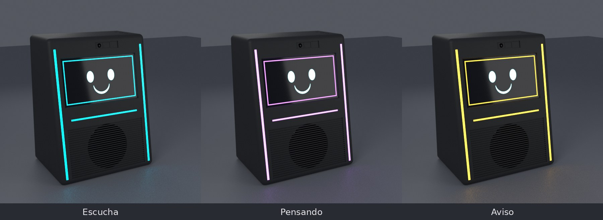

# 11 — Software
Arquitectura prevista:
`Micrófono → STT → LLM → TTS → audio + lip-sync → avatar`

La interfaz mostrará avatar, estados, respuestas, reproducción y controles táctiles.

## Luz de estado (D033)

Las franjas de los cantos, la barra bajo la pantalla y un marco de color que la interfaz dibuja alrededor de la pantalla cambian juntos según el estado. Colores de partida (configurables):

| Estado | Franjas y barra | Marco en pantalla |
|---|---|---|
| Reposo | Apagadas o blanco cálido muy tenue (modo ambiente) | No |
| Escucha (tras la palabra de activación) | Cian fijo, sube de intensidad | Cian |
| Pensando | Pulso violeta que recorre las franjas de abajo arriba | Violeta tenue |
| Hablando | Cian; la barra sigue el volumen de la voz | Cian tenue |
| Micrófonos silenciados (interruptor, GPIO13) | Rojo tenue fijo en la barra | No |
| Aviso, temporizador o mensaje | Ámbar parpadeando despacio | Ámbar |
| Error o sin conexión | Naranja fijo | No |
| Cámara activa | Un LED blanco en lo alto de cada franja (privacidad) | — |
| Modo noche | Brillo al 10 % o apagado | — |

Límite de corriente de los LEDs: 0,6 A (ver `10_electronica.md`).
