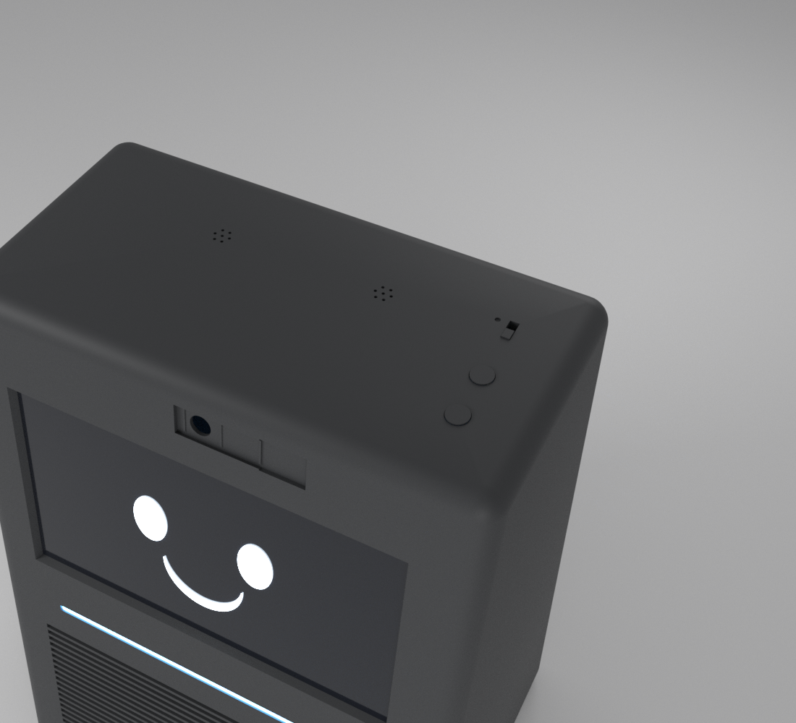
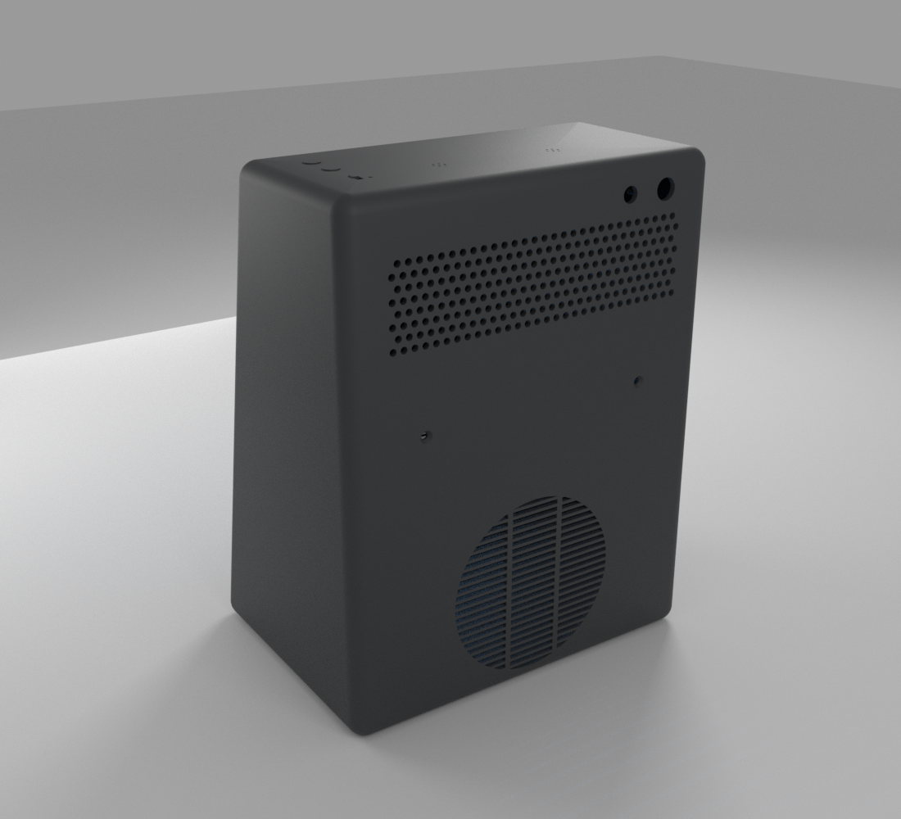

# 14 — Capucha (pieza 3) · v0.2

Es la parte de la carcasa que queda por encima de la cubeta acústica (z > 108 mm).
- **Archivo:** `enclosure/openscad/capucha.scad`.
- **STL:** `stl/capucha_v0_2.stl` y sus piezas sueltas.

## División de la carcasa (D027)
| Pieza | Medidas | Material | Orientación |
|---|---|---|---|
| 1. Cubeta acústica | 205 × 148 × 108 mm | PLA negro mate | De pie |
| 2a. Bandeja delantera | en diseño | PLA | Plana |
| 2b. Caja superior de la cámara (suelo de la electrónica) | en diseño | PETG | Boca abajo |
| **3. Capucha** | **205 × 129 × 154 mm** | **PLA negro mate** | **Boca abajo (techo en la cama)** |

## Diseño (D031)
Vuelve al boceto original: frontal inclinado de arriba abajo, aristas redondeadas (r = 9 mm), laterales lisos y negro mate. En negro mate las líneas de capa apenas se ven, así que se quitan las estrías (D028 queda sin efecto).

## Qué lleva
| Elemento | Detalle |
|---|---|
| Pantalla | Ventana del área visible + 0,5 mm con chaflán de 1,5 mm. 4 resaltes con cartabón a 45° para tornillos M2.5 × 6 |
| Cámara | Agujero de 8 mm, 4 resaltes M2 y guía en cola de milano con zona de entrada para la tapa deslizante (D026) |
| Franja LED | Ranura de 142 × 3 mm entre la banda de lamas y la pantalla. Difusor translúcido aparte |
| Micrófonos | 2 grupos de 7 agujeros de 1,2 mm en el techo y raíles para el ReSpeaker Lite |
| Botones (D032) | En el techo, a la derecha: dos capuchones de 8 mm (volumen − y +) y el interruptor deslizante de silencio, con un punto para pintar en rojo que queda a la vista al silenciar. Placa de botones atornillada por dentro |
| Trasera | Perforado de puntos de 3,5 mm (ventilación), conector DC y botón de encendido de 8 mm |
| Uniones (D029) | 2 pasadores delante, que encajan en la bandeja, y 2 tornillos M3 avellanados detrás, a la caja superior |

## Piezas sueltas
| STL | Material | Notas |
|---|---|---|
| `capuchones_botones_v0_1.stl` | PLA negro | Volumen −, volumen + y uno liso para el encendido. Asoman 0,5 mm y la pestaña interior los retiene |
| `deslizador_silencio_v0_1.stl` | PLA negro | Mando del SS12D00. Entra a presión en la palanca |
| `placa_botones_v0_1.stl` | PLA o PETG | Lleva 2 pulsadores de 6 × 6 × 5 mm y el SS12D00. Se fija con 2 tornillos M2 |
| `difusor_led_v0_2.stl` | PETG o PLA natural | Se pega por dentro con su pestaña |
| `tapa_camara_corredera_v0_2.stl` | PLA negro | Usa la holgura que te haya ido bien con la pieza de prueba |

## Impresión
- **Capucha:** boca abajo, con el techo sobre la cama. PLA negro mate, capa de 0,2 mm, 3 perímetros y 15 % de relleno; unos 290 cm³.
- **Aristas redondeadas que tocan la cama:** solo los últimos 2–3 mm del redondeo superan los 45°. Con PLA y buena ventilación salen sin soportes.

## Comprobación
`python3 tools/comprobar_capucha.py` comprueba que la malla está cerrada, que cabe en la cama y que no choca con los componentes.

## Pendiente de verificar
- Posición de los micrófonos del ReSpeaker Lite (los grupos de agujeros toleran ±3 mm).
- Alto del objetivo de la cámara (`cam_standoff`).
- Ajuste del deslizador sobre la palanca del SS12D00 y del capuchón sobre el pulsador.
