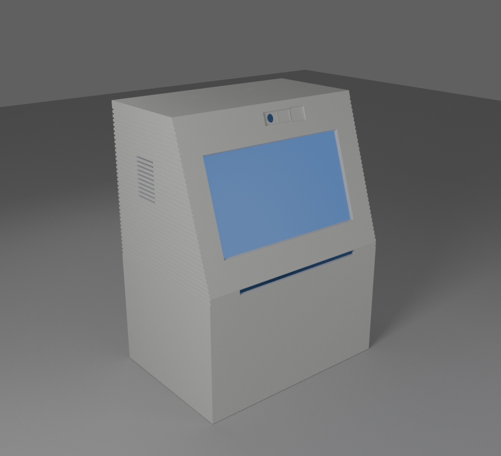
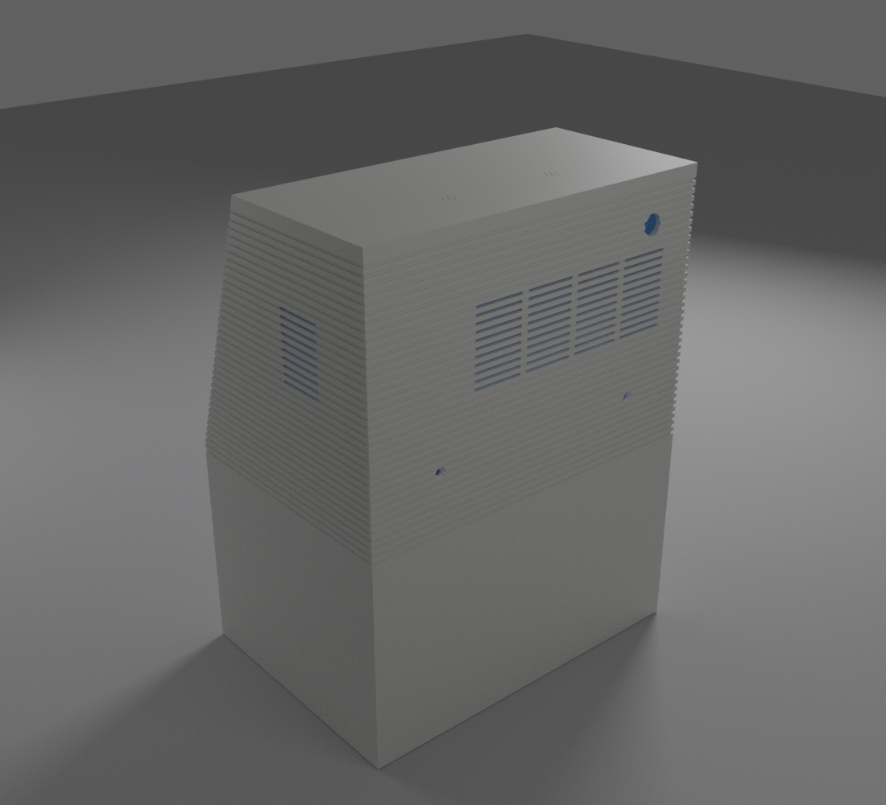
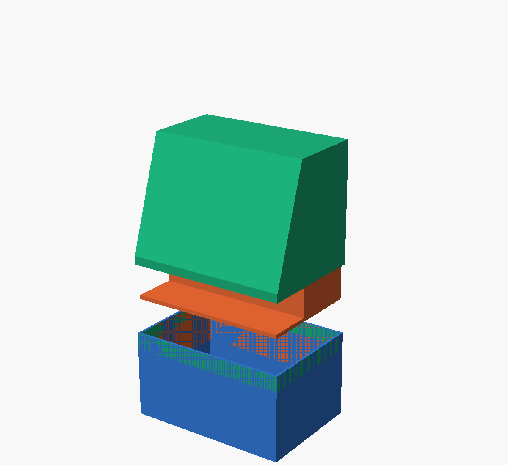

# 14 — Capucha (pieza 3)

Es la parte de la carcasa que queda por encima de la cubeta acústica (z > 111 mm).
- **Archivo:** `enclosure/openscad/capucha.scad`.
- **STL listos para imprimir:** `stl/capucha_v0_1.stl`, `stl/difusor_led_v0_1.stl` y `stl/tapa_camara_corredera_v0_1.stl`.

## División de la carcasa (D027)

| Pieza | Medidas | Material | Orientación |
|---|---|---|---|
| 1. Cubeta acústica | 205 × 145 × 111 mm | PLA | De pie |
| 2a. Bandeja delantera | 199 × 61 × 5 mm | PLA | Plana |
| 2b. Caja superior de la cámara (suelo de la electrónica) | 199 × 83 × 64 mm | PETG | Boca abajo |
| **3. Capucha** | **205 × 145 × 155 mm** | **PLA** | **Boca abajo (techo en la cama)** |

La carcasa mide 266 mm de alto y la Kobra X imprime 260, así que no cabe entera.
- **Cámara acústica:** las piezas 1, 2a y 2b forman la cámara estanca y no se vuelven a abrir.
- **Acceso a la electrónica:** la capucha se levanta entera, con la pantalla, para llegar a toda la electrónica.

## Qué lleva la capucha
| Elemento | Detalle |
|---|---|
| Estrías (D028) | Surcos de 1,6 mm × 0,8 mm cada 4 mm en laterales y trasera. Al imprimir boca abajo quedan paralelos a las capas y las disimulan |
| Rejillas | En la trasera y los laterales, a la altura de la electrónica, las estrías atraviesan la pared en tramos de 28 mm con nervios de 4 mm |
| Pantalla | Ventana del área visible + 0,5 mm con chaflán de 1,5 mm. 4 resaltes con cartabón a 45° para tornillos M2.5 × 6 autorroscantes |
| Cámara | Agujero de 8 mm, 4 resaltes para tornillos M2 (patrón 21 × 12,5 mm) y guía en cola de milano con zona de entrada para la tapa deslizante (D026) |
| Barra LED | Ranura de 142 × 5 mm y difusor aparte en filamento translúcido, pegado por dentro con su pestaña |
| Micrófonos | 2 grupos de 7 agujeros de 1,2 mm en el techo. Raíles para que la placa del ReSpeaker Lite se deslice justo bajo el techo, con tope |
| Alimentación | Taladro de 11,2 mm para el conector DC de panel, en la trasera, por encima de la rejilla |
| Ventilador opcional | 4 resaltes para un ventilador de 40 mm tras la rejilla trasera (tornillos M3 autorroscantes) |
| Uniones (D029) | Delante, 2 pasadores de 3 mm que encajan en la bandeja (2a). Detrás, 2 tornillos M3 avellanados que roscan en insertos de la caja superior (2b) |

## Impresión
- **Posición:** boca abajo, con el techo sobre la cama. Todo lo interior está pensado para imprimirse así sin soportes; si el laminador los pide, solo en la ventana de la pantalla.
- **Ajustes:** PLA, capa de 0,2 mm, 3 perímetros y 15 % de relleno. Pesa unos 290 cm³, alrededor de 360 g al 100 %; con relleno real, menos.
- **Estrías:** conviene que las capas queden alineadas con las estrías (capa de 0,2 o 0,4 mm; los 4 mm de paso son múltiplo de ambas).
- **Difusor de la barra LED:** PETG o PLA natural (translúcido), plano.
- **Corredera de la tapa de la cámara:** plana. La holgura es `clear` en `capucha.scad`: usa la que te haya ido bien con la pieza de prueba.

## Cámara
Se usa la **OV5647 de 5 MP** (compatible con la cámara oficial v1.3). Su placa es igual que la de la Camera Module 3: 25 × 24 mm con el mismo patrón de taladros.
- **Separación de la placa:** el soporte la deja a 5 mm de la cara interior del frontal (`cam_standoff`). Mide el alto del objetivo de tu cámara y ajústalo si hace falta.
- **Cable para la Pi 5:** la Pi 5 usa un conector de cámara más estrecho (22 pines). Comprueba que el cable que trae la cámara tenga un extremo de 22 pines; si no, hace falta un cable 22 → 15 pines.

## Comprobación
Para comprobarlo, ejecuta `python3 tools/comprobar_capucha.py`. Comprueba tres cosas:
- que la malla está cerrada;
- que cabe en la cama;
- que no choca con ningún componente del volumétrico (pantalla, cámara, micrófonos, Pi, KABD-250, etc.).

## Pendiente de verificar con las piezas reales
- Posición exacta de los 2 micrófonos del ReSpeaker Lite. Los grupos de agujeros toleran ±3 mm.
- Alto del objetivo de la cámara (`cam_standoff`).
- Diámetro del conector DC que compres.
