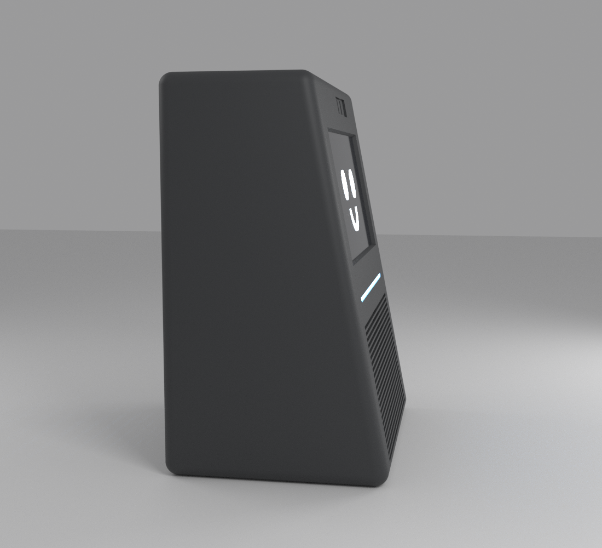

# 15 — Cubeta acústica (pieza 1) · v0.3

Es la parte inferior de la carcasa (z 0–108 mm) y forma el bloque principal de la cámara acústica.
- **Archivo:** `enclosure/openscad/cubeta.scad`.
- **STL:** `stl/cubeta_v0_3.stl` (205 × 148 × 108 mm, unos 380 cm³) y `stl/pata_tpu_v0_2.stl` (× 4).

## Banda de lamas y altavoz (D030, D031)
- **Banda de lamas:** el frontal inclinado lleva una banda horizontal de lamas de 2,4 mm cada 4 mm, a todo lo ancho (22 mm de margen por lado).
- **Delante del cono:** dentro de un círculo de 86 mm las lamas atraviesan la pared y dejan salir el sonido.
- **Resto de la banda:** es decorativo. Las lamas solo tienen 1,8 mm de fondo, así que la cámara queda cerrada.
- **Montaje del altavoz:** va por dentro, sobre un anillo paralelo al frontal que deja 7 mm hasta la rejilla, y queda inclinado 11° hacia el usuario.
- **Radiador:** va detrás, con una rejilla circular de 94 mm y un anillo de 14 mm (su recorrido llega a 9 mm).
- **Fijación:** 4 insertos M3 por anillo (±44,9 mm según la tienda, **medir**) y junta de espuma de 2 mm.

## Resto de la pieza
| Elemento | Detalle |
|---|---|
| Rebordes interiores | En los laterales y en la trasera (fuera del radiador), con chaflán a 45°. Ahí apoyan la bandeja (2a) y la caja superior (2b). Llevan 8 insertos M3 |
| Refuerzos | 2 nervios verticales por lateral |
| Patas | 4 alojamientos de 16 mm para patas de TPU de 5 mm |
| Franjas de luz (D033) | Ranura de 4 mm en cada canto del frontal y canal cerrado detrás para la tira WS2812B. El canal está separado de la cámara acústica y solo se abre por arriba, hacia la capucha. El inserto transparente `franja_inf_v0_1.stl` (2 iguales) entra deslizando desde arriba |

## Volumen de la cámara
`tools/comprobar_cubeta.py` mide el volumen real:

| Concepto | Litros |
|---|---:|
| Aire del volumétrico | 3,52 |
| Ocupado por la cubeta (incluidos los canales de las franjas) | −0,11 |
| Aire delante de los conos (fuera de la caja) | −0,15 |
| Reserva (espuma, cableado) | −0,10 |
| Paredes de la caja superior (2b) | −0,05 |
| **Neto** | **≈ 3,11** |

La simulación con 3,1 L ya está hecha (ver `05_audio.md`): radiador + 10 g, sintonía ≈ 44 Hz, ≈ 10 W útiles y ≈ 94 dB a 100 Hz.

## Impresión
- De pie, suelo en la cama, PLA negro mate, 3–4 perímetros, 20 % de relleno. Sin soportes.
- Patas en TPU al 100 %.
- Insertos de las franjas: PETG o PLA transparente, tumbados con la cara vista sobre la cama (la textura de la cama los deja esmerilados y difunden mejor).

## Pendiente de verificar con las piezas reales
- Taladros, recortes y grosor del marco del altavoz y del radiador.
- Cuánto sobresale la suspensión de cada cono por delante del marco (`drv_clear`, `pr_clear`).
