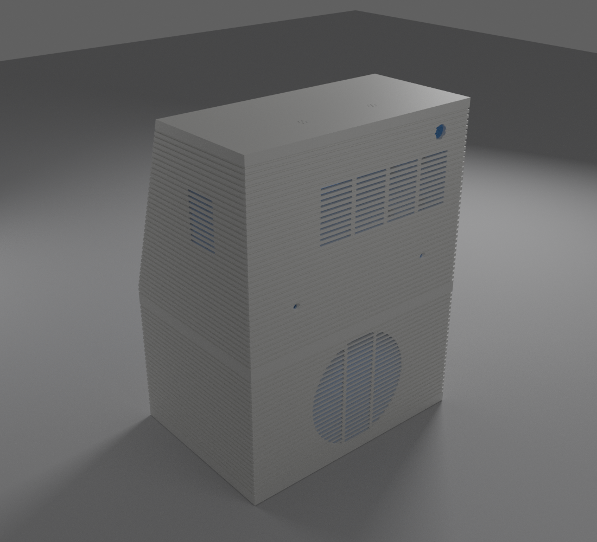
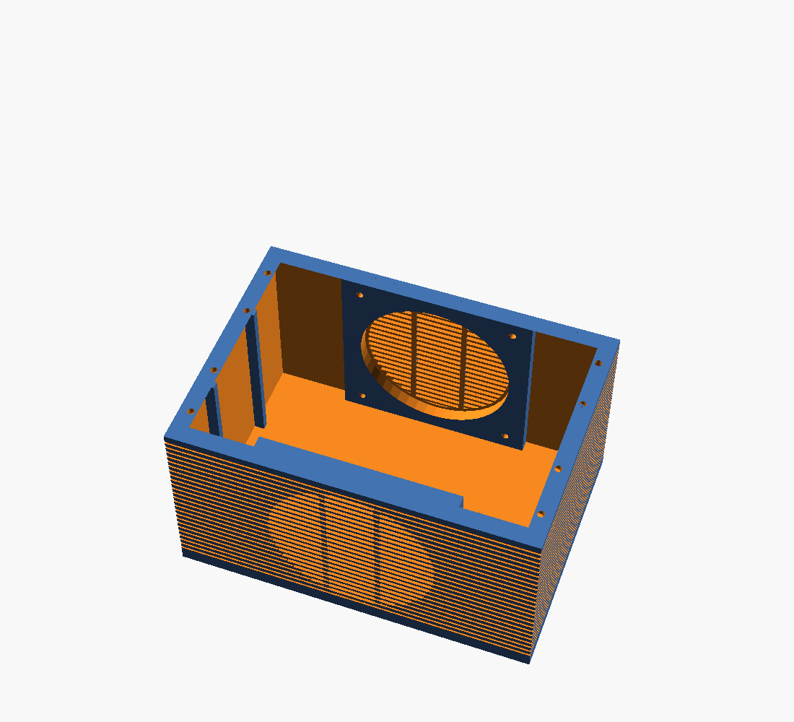

# 15 — Cubeta acústica (pieza 1)

Es la parte inferior de la carcasa (z 0–111 mm) y forma el bloque principal de la cámara acústica.
- **Archivo:** `enclosure/openscad/cubeta.scad`.
- **STL:** `stl/cubeta_v0_1.stl` (205 × 145 × 111 mm, unos 400 cm³) y `stl/pata_tpu_v0_1.stl` (× 4).

## Rejilla integrada y montaje por dentro (D030)
- **Rejillas:** delante del altavoz y detrás del radiador, la pared lleva ranuras horizontales de 2,4 mm, que dejan pasar un 60 % del aire. Coinciden con las estrías de 4 mm de los laterales y tienen 2 nervios verticales para que los puentes no pasen de 30 mm.
- **Montaje por dentro:** el altavoz y el radiador se meten por arriba y se atornillan desde dentro, con el marco apoyado en un anillo de montaje que lo separa de la rejilla:
  - **altavoz:** 7 mm (suspensión ≈ 3 + Xmax 2,5 + margen);
  - **radiador:** 14 mm, porque su cono se mueve hasta 9 mm.
- **Fijación:** 4 insertos M3 de latón por anillo, en las esquinas del marco (±44,9 mm, según la tienda: **medir**). Junta de espuma de 2 mm entre marco y anillo.

## Resto de la pieza
| Elemento | Detalle |
|---|---|
| Estrías | Laterales y trasera, en la misma rejilla de 4 mm que la capucha. Se deja una franja lisa junto a la unión |
| Rebordes interiores | 7 mm de ancho a 111 mm de altura, con chaflán a 45° (sin soportes). Delante y detrás solo fuera de los marcos. Aquí apoyan la bandeja (2a) y la caja superior (2b) |
| Insertos de los rebordes | 8 insertos M3 en los laterales para atornillar la bandeja y la caja superior |
| Refuerzos | 2 nervios verticales por lateral contra vibraciones de las paredes |
| Patas | 4 alojamientos de 16 mm para patas de TPU de 5 mm |

## Volumen de la cámara
`tools/comprobar_cubeta.py` mide el volumen real con la pieza:

| Concepto | Litros |
|---|---:|
| Aire del volumétrico | 3,53 |
| Ocupado por la cubeta (anillos, rebordes, refuerzos) | −0,12 |
| Aire delante de los conos (fuera de la caja) | −0,15 |
| Reserva para espuma y cableado | −0,10 |
| **Neto** | **≈ 3,16** |

La caja superior (2b) restará unos 0,05 L más, así que el neto final queda en unos **3,1 L**. Para compensar lo que restan los anillos, la parte alta de la cámara ha crecido: su techo pasa de 170 a 176 mm y su pared delantera se adelanta de 64 a 60 mm. La electrónica sube 6 mm sin chocar con nada. Repetida la simulación con 3,1 L, los resultados apenas cambian: el radiador con +10 g resuena a unos 44 Hz, la potencia útil sigue en unos 10 W y el volumen máximo a 100 Hz en unos 94 dB.

## Impresión
- De pie, con el suelo en la cama, en PLA: capa de 0,2 mm, 3–4 perímetros y 20 % de relleno.
- Las ranuras de la rejilla son puentes cortos; activa la refrigeración al 100 % en los puentes.
- Patas: TPU, 100 % de relleno.

## Pendiente de verificar con las piezas reales
- Taladros del altavoz y del radiador (`bolt_off`), recortes (`drv_cut`, `pr_cut`) y grosor del marco.
- Cuánto sobresale la suspensión de cada cono por delante del marco (`drv_clear`, `pr_clear`).
