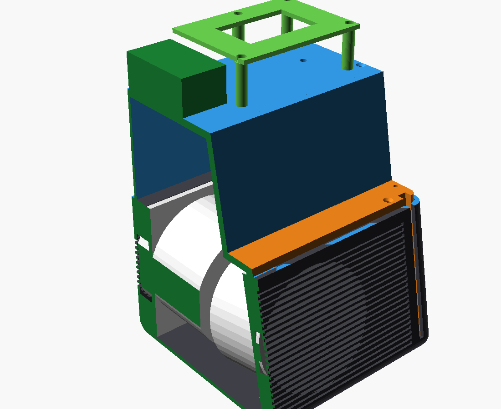
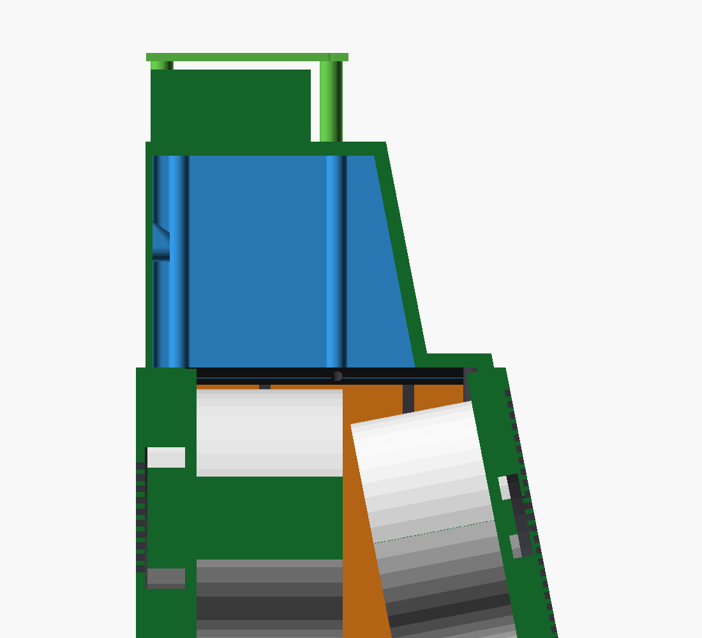

# 16 — Bandeja (2a), caja superior (2b) y balda del KABD · v0.1

Cierran la cámara acústica por arriba y forman el suelo de la bahía de electrónica (D027, D034).
- **Archivos:** `enclosure/openscad/bandeja.scad` y `enclosure/openscad/caja_superior.scad`.
- **STL:** `stl/bandeja_v0_1.stl`, `stl/caja_superior_v0_1.stl` (ya girada para imprimir) y `stl/balda_kabd_v0_1.stl`.

| Pieza | Medidas | Material | Impresión |
|---|---|---|---|
| 2a. Bandeja | 198 × 28 × 5 mm | PLA negro | Plana, sin soportes |
| 2b. Caja superior | 198 × 98 × 79 mm, unos 225 cm³ | PETG | Boca abajo (tapa en la cama), sin soportes |
| Balda del KABD-250 | 97 × 71 × 31 mm | PLA o PETG | Placa en la cama, patas hacia arriba |

## Bandeja (2a)
- Placa de 5 mm entre el frontal y el tabique (z 108–113). Es el techo del bloque inferior de la cámara delante del tabique.
- Apoya en el **reborde delantero** de la cubeta (nuevo, a todo lo ancho), en los rebordes laterales y en el anillo del altavoz, con burlete de espuma debajo.
- 2 tornillos M3 × 10 avellanados delante, a insertos de la cubeta (a 25 mm de cada lateral). Por detrás la pisa el tabique de la caja superior.
- Agujeros para los 2 pasadores de la capucha (D029) y muescas que cierran el canal de las franjas de luz (D033).
- El borde delantero queda 1 mm retrasado respecto a la pared: la capucha baja en vertical y, por la inclinación del frontal, su pared avanza ≈1 mm en los últimos 5 mm de recorrido.

## Caja superior (2b)
- Tabique inclinado de 5 mm paralelo al frontal (detrás de la pantalla), laterales y trasera de 2,5 mm y tapa de 5 mm. Abierta por abajo.
- Holgura de 0,3 mm con la capucha por todos lados.
- Apoya en los rebordes laterales y trasero de la cubeta y en el anillo del radiador, y el tabique pisa la parte trasera de la bandeja. Burlete de espuma en todo el apoyo.
- **Fijación:** 4 tubos verticales con tornillos M3 × 80 avellanados desde la tapa hasta los insertos de los rebordes laterales (y = 80 y 135 mm).
- **Capucha:** 2 resaltes con inserto M3 en la trasera, a la altura de los tornillos traseros de la capucha (D029).
- **Cables del altavoz:** agujero de 5 mm en la tapa (detrás, a la derecha). Se sella con silicona neutra después de pasar los cables.
- **Bahía:** la tapa queda lisa por fuera para poder imprimirla sobre la cama. Lleva insertos ciegos (4 mm en una tapa de 5, así que no abren la cámara):
  - 4 insertos M2.5 para la Pi 5, con separadores de nailon M2.5 × 3 mm;
  - 4 insertos M3 para las patas de la balda.
- El conversor y el DAC se fijan con cinta de doble cara o velcro.

## Balda del KABD-250
- Placa de 3 mm sobre 4 patas de 28 mm, encima de la Pi 5. Las patas evitan los puertos de la Pi, el conversor y el DAC.
- Tornillos M3 × 35 desde arriba, por dentro de las patas, hasta los insertos de la tapa.
- Los taladros del KABD-250 se añadirán cuando llegue y se pueda medir.

## Volumen de la cámara con todas las piezas
`python3 tools/comprobar_camara.py` comprueba las tres piezas (mallas, cama, choques con la cubeta, la capucha y los componentes) y mide el volumen neto:

| Concepto | Litros |
|---|---:|
| Aire del volumétrico | 3,54 |
| Cubeta (anillos, rebordes, canales de las franjas) | −0,13 |
| Caja superior (paredes, tubos, resaltes) | −0,07 |
| Aire delante de los conos | −0,15 |
| Reserva (espuma, cableado) | −0,10 |
| **Neto** | **≈ 3,08** |

Con 3,08 L la simulación apenas cambia: radiador + 10 g, sintonía ≈ 44 Hz, ≈ 10 W y ≈ 94 dB a 100 Hz.

## Orden de montaje de la cámara
1. Insertos en la cubeta: 4 del altavoz, 4 del radiador, 2 de la bandeja y 4 de los rebordes laterales.
2. Altavoz y radiador con su junta de espuma. Relleno acústico.
3. Franjas inferiores: tira de LEDs y conector en el canal, inserto transparente deslizado desde arriba.
4. Burlete en el reborde delantero, los laterales y el anillo. Bandeja con sus 2 tornillos.
5. Cables del altavoz por el agujero de la tapa, sellado con silicona. Burlete en los apoyos de la caja superior, caja en su sitio y 4 tornillos M3 × 80.
6. Bahía: Pi 5, conversor, DAC y balda con el KABD-250.
7. Capucha: pasadores delante y 2 tornillos M3 detrás.
